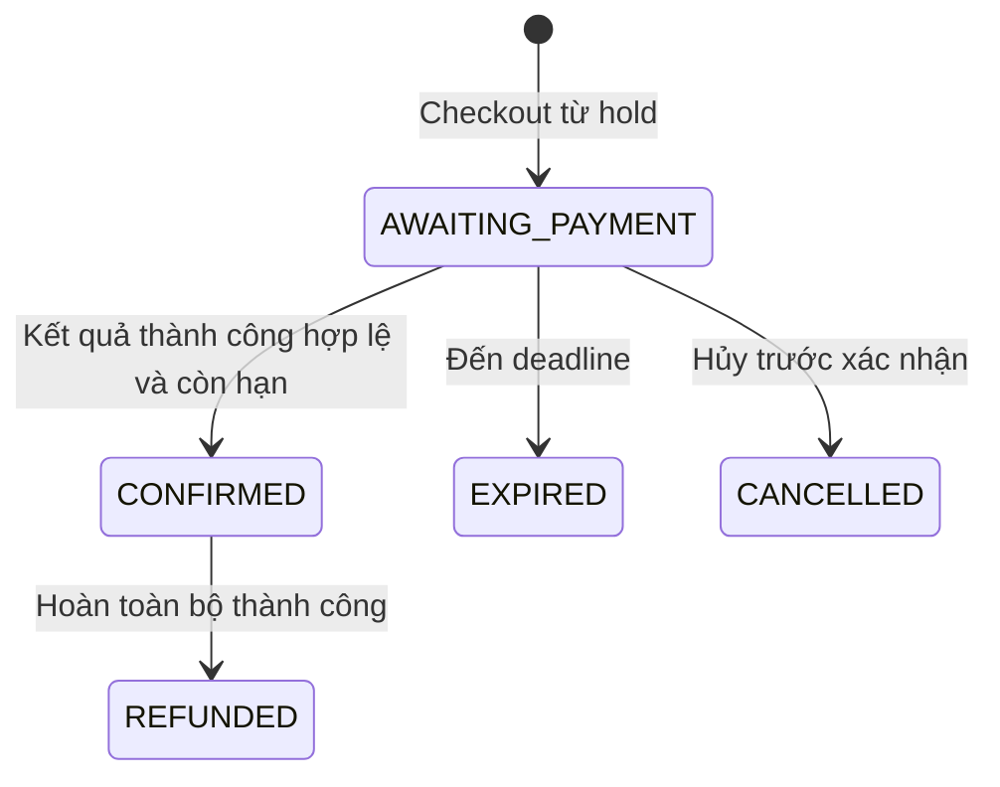

# 07. Quy tắc nghiệp vụ và máy trạng thái

Quyết định hiện hành theo [18](18-open-questions.md) và [23](23-organization-review-seatmap.md); chỉ phần ghi rõ còn mở mới cần quyết định thêm. Bất biến kỹ thuật luôn bắt buộc.

## Danh mục quy tắc

| ID | Quy tắc |
| --- | --- |
| BR-001 | Trong một session, một seat chỉ có một chủ phân bổ hiện tại và tối đa một vé có quyền vào cửa tại một thời điểm |
| BR-002 | Ghế HELD còn hạn không thể giữ/bán cho khách khác; xử lý nhóm ghế nguyên tử |
| BR-003 | Hold hết hạn khi expires_at <= DB_NOW; TTL 5 phút, worker chậm không kéo dài quyền giữ |
| BR-004 | Chỉ phát vé khi payment thành công đã xác minh, booking hợp lệ và vẫn sở hữu tất cả ghế |
| BR-005 | Event CANCELLED/BLOCKED hoặc session không bán không nhận hold/booking/xác nhận mới; thành công payment muộn cần bù trừ |
| BR-006 | Một hold chỉ thuộc một khách/một session và chuyển thành tối đa một booking; Q-007 |
| BR-007 | Checkout không gia hạn hold; deadline booking bằng expiry đã báo; Q-001 |
| BR-008 | Tối đa 6 ghế/booking; một phân bổ còn hạn/user/session, gồm ACTIVE hold và CONVERTED có booking AWAITING_PAYMENT; quota kiểm tra nguyên tử |
| BR-009 | Giá hold được chụp lúc giữ; booking chụp từ hold item và tổng tính trên server; currency/thuế/phí theo Q-003 |
| BR-010 | Mỗi lần thử payment có key riêng; một booking chỉ có một attempt PENDING; timeout mạng chưa chứng minh thất bại |
| BR-011 | Callback xác minh nguồn, payment reference, amount, currency; lặp không tạo thêm hiệu ứng |
| BR-012 | Payment SUCCESS đến sau hạn/hủy hoặc mất phân bổ vẫn được ghi nhận tiền; không hồi sinh booking, phải đối soát/hoàn tiền |
| BR-013 | Mỗi booking item có tối đa một ticket; rollback phát vé cũng rollback xác nhận đơn/tồn kho |
| BR-014 | QR không chứa PII; không thể dùng chỉ bằng ID tuần tự; không log QR/token |
| BR-015 | CheckIn online/tại quầy không consume vé; vào cửa chỉ VALID, có CheckIn, đúng session/window và người quét thuộc tổ chức; hai quét chỉ một USED |
| BR-016 | Ticket USED/CANCELLED/REFUNDED/EXPIRED không thể check-in hoặc tự trở lại VALID |
| BR-017 | Refund không vượt số thực nhận trừ số đã hoàn và đang xử lý; mọi khoản cùng currency |
| BR-018 | Điều kiện refund, deadline, người duyệt, phí và bán lại ghế theo Q-004; đề xuất chỉ hoàn toàn bộ vé chưa dùng |
| BR-019 | Booking đã CONFIRMED không chuyển CANCELLED để bỏ qua hoàn tiền; event hủy không đồng nghĩa tiền đã hoàn |
| BR-020 | Organizer là tổ chức; service kiểm tra Organization APPROVED và membership của actor, event.organization_id là scope sở hữu |
| BR-021 | Venue catalog có bounds/capacity; layout thuộc organization/event, frozen trước gửi duyệt; không sửa cấu trúc có phân bổ hoặc thay catalog làm đổi layout đã duyệt |
| BR-022 | Session phải kết thúc sau bắt đầu, cửa sổ bán hợp lệ; xung đột venue và đổi lịch theo Q-010 |
| BR-023 | Chỉ xóa cứng event nháp/venue chưa có phụ thuộc; giao dịch lưu lịch sử và FK không cascade xóa tiền/vé |
| BR-024 | Tài khoản BLOCKED không tạo phiên, giữ ghế hoặc mua; khóa thu hồi phiên; đơn cũ vẫn được đối soát |
| BR-025 | Khách không tự cấp role, chỉnh giá/trạng thái booking/payment hoặc gán chủ sở hữu |
| BR-026 | Admin duyệt role/event; can thiệp quản lý/refund cần report còn mở liên quan đúng tài nguyên, quyền/lý do/audit; không bypass BR-001/BR-004 |
| BR-027 | Doanh thu thành công và hoàn tiền được báo riêng; payment thất bại/đang chờ không là doanh thu |
| BR-028 | Timestamp lưu UTC và dựa giờ DB cho expiry; UI hiển thị timezone session |
| BR-029 | Google/phone OTP và email công ty theo 04; đa thiết bị, identity linking không tự merge tài khoản, không có reset mật khẩu nội bộ |
| BR-030 | Email, realtime, AI lỗi không thay đổi kết quả giao dịch đã commit |
| BR-031 | Client không có quyền báo thanh toán thành công; mock chỉ chạy ngoài production |
| BR-032 | Idempotency key có scope actor/operation; hash request đã chuẩn hóa gồm target route params và payload theo [09](09-api-design.md); cùng key khác target/payload trả 409; replay vẫn kiểm tra quyền hiện tại |

## Vòng đời event, hồ sơ duyệt và session

DRAFT → PENDING_REVIEW khi Organizer gửi bản hợp lệ ít nhất một tháng trước session sớm nhất. Chỉ Admin event.review được PENDING_REVIEW → PUBLISHED, trước review.expires_at và đúng event.version. Admin từ chối hoặc hồ sơ hết 15 ngày: Event → REJECTED; EventReview tương ứng REJECTED/EXPIRED. Organizer sửa REJECTED → DRAFT hoặc rút PENDING_REVIEW → DRAFT, review cũ WITHDRAWN; nộp lại tạo review mới, vẫn kiểm tra lead time.

Review PENDING → APPROVED/REJECTED/EXPIRED/WITHDRAWN; tối đa một review PENDING/event. Deadline và form/notification theo [23](23-organization-review-seatmap.md). APPROVED gắn đúng version, không duyệt muộn hoặc tự publish khi timer hết. REJECTED vì hết hạn là hủy hồ sơ chưa đăng, không phải CANCELLED một sự kiện đã bán.

Event DRAFT/REJECTED/PENDING_REVIEW/PUBLISHED → CANCELLED khi Organizer hủy hợp lệ; hồ sơ PENDING đi WITHDRAWN trong cùng transaction nếu có. Admin PUBLISHED → BLOCKED chỉ qua report. PUBLISHED → ARCHIVED khi mọi session kết thúc và không còn việc bán đang chờ. Không tự mở lại BLOCKED; không PATCH nội dung/layout/giá/lịch ở PENDING_REVIEW hoặc PUBLISHED để vượt duyệt. Nội dung sửa trong nháp trước submit.

Session SCHEDULED → CANCELLED hoặc COMPLETED. Đang bán khi event PUBLISHED, session SCHEDULED và sale_opens_at <= DB_NOW < sale_closes_at. Cấu hình sale/check-in/admission windows được duyệt cùng event; chính sách bán sau giờ bắt đầu và trùng lịch venue còn phải xác định trước các trường hợp đó.

## Bổ sung quy tắc theo quyết định 2026-09-12

| ID | Quy tắc |
| --- | --- |
| BR-033 | Organization và membership được Admin duyệt; domain/email công ty được xác minh, không cấp role bằng suffix client gửi |
| BR-034 | Submit trước session sớm nhất ít nhất một tháng lịch; review có hạn 15 ngày; approval và expiry phân xử bằng DB_NOW sau khóa |
| BR-035 | Review hết hạn tạo notification hủy hồ sơ và nhiệm vụ phiếu lý do; Admin phải soạn/xác nhận form, không trì hoãn expiry để chờ phiếu |
| BR-036 | Một loại vé có code trong session; mỗi vé phát hành có mã riêng đủ entropy, không dùng code loại vé làm credential |
| BR-037 | Checkout có attendeeName cho từng SessionSeat khớp tập hold; snapshot tên, người mua vẫn sở hữu booking; đổi tên khi replay là conflict |
| BR-038 | Self check-in chỉ vé thuộc khách đang đăng nhập, tên/mã khớp, từ starts_at-24h đến trước starts_at; quầy thuộc Organization; UQ CheckIn.ticket_id |
| BR-039 | CheckIn giữ vé VALID; vào cửa mới USED. Refund/cancel vô hiệu quyền dù đã CheckIn, không xóa lịch sử xác nhận |
| BR-040 | Layout/ghế không vượt bounds/capacity hoặc chồng sân khấu/vùng cấm; backend validate, frozen không sửa; SessionSeat tham chiếu layout đúng event/venue |
| BR-041 | Report chỉ cấp ngữ cảnh hỗ trợ cho tài nguyên liên quan khi còn OPEN/IN_REVIEW; đóng report không cho thao tác can thiệp mới |

## Booking state machine

Không dùng PENDING/HOLDING vì SeatHold quản lý giữ ghế trước checkout. Không có PAID trung gian vì MVP xác nhận và phát vé cùng transaction DB. “Đã trả tiền nhưng không được cấp vé” là trạng thái của Payment kèm đối soát, không tạo trạng thái booking mơ hồ.

| Chuyển | Điều kiện và hiệu ứng |
| --- | --- |
| Tạo → AWAITING_PAYMENT | Hold đúng chủ, còn hạn; lưu giá và expiry |
| AWAITING_PAYMENT → CONFIRMED | Payment hợp lệ, event/session cho bán, chưa hết hạn; chuyển ghế SOLD, tạo Ticket VALID |
| AWAITING_PAYMENT → EXPIRED | Giờ DB đạt deadline; giải phóng toàn nhóm ghế còn thuộc đơn |
| AWAITING_PAYMENT → CANCELLED | Khách hủy được phép hoặc event bị dừng; nhả ghế; payment đang chờ vẫn cần theo dõi |
| CONFIRMED → REFUNDED | Refund toàn bộ thành công; vé REFUNDED; ghế xử lý theo Q-004 |

EXPIRED/CANCELLED/REFUNDED là kết thúc trong MVP. Cấm EXPIRED → CONFIRMED, CANCELLED → AWAITING_PAYMENT, CONFIRMED → CANCELLED. Payment thất bại không kết thúc booking nếu còn hạn; refund do Organizer duyệt (Admin chỉ theo report); trạng thái chờ nằm ở Refund, booking vẫn CONFIRMED và vé bị vô hiệu hóa khi refund được duyệt.

## Payment state machine

Một hàng là một attempt. Bỏ CREATED vì PENDING được ghi trước lần gọi adapter đầu tiên; chưa rõ đã gửi vẫn PENDING và phải retry bằng cùng provider key. Không dùng EXPIRED cho timeout mạng; timeout checkout thuộc Booking.

| Chuyển | Điều kiện |
| --- | --- |
| Tạo → PENDING | Lưu booking, số tiền, currency, provider key trước gọi ngoài |
| PENDING → SUCCESS | Kết quả thành công đã xác minh; có thể đi vào đối soát nếu booking hết hạn |
| PENDING → FAILED | Nhà cung cấp xác nhận thất bại cuối cùng; không chỉ do HTTP timeout |
| SUCCESS → REFUNDED | Tổng refund thành công bằng số tiền payment |
| SUCCESS → PARTIALLY_REFUNDED | Sau MVP, Q-004; chưa triển khai trạng thái này ở MVP |
| PARTIALLY_REFUNDED → REFUNDED | Sau MVP, hoàn hết số còn lại |

Không FAILED → PENDING; retry tạo attempt mới. Nếu nhà cung cấp gửi SUCCESS cho attempt từng xác nhận FAILED, cách ly và đối soát theo hợp đồng provider; không tự phát vé, không bỏ qua khoản tiền. Callback thành công trùng hoặc thất bại đến sau SUCCESS không đảo trạng thái. `reconciliation_status = NONE/REQUIRED/RESOLVED` và lý do lưu riêng với trạng thái tiền.

Bản SQL theo ADR-011 không chặn lưu nhiều khoản SUCCESS bất thường của một booking; `confirmed_payment_id` chỉ định khoản dùng xác nhận đơn. Khoản thừa cần reconciliation, không cấp thêm vé. Khi bù trừ tiền cho booking EXPIRED/CANCELLED, trạng thái booking giữ nguyên; chỉ Payment/Refund phản ánh tiền đã hoàn.

Refund: REQUESTED → REJECTED hoặc PROCESSING (duyệt và thu hồi quyền vé); PROCESSING → SUCCESS hoặc FAILED khi có kết quả chắc chắn; FAILED → PROCESSING khi người có quyền retry cùng refund/provider key. Kết quả chưa rõ giữ PROCESSING. Không tạo refund mới chỉ vì timeout. Hoàn tiền bù trừ do BR-012 có loại COMPENSATION, tự động hóa chỉ sau Q-004; trước đó tạo công việc đối soát.

## Ticket state machine

| Chuyển | Điều kiện |
| --- | --- |
| Tạo → VALID | Booking CONFIRMED trong cùng transaction |
| VALID → USED | Quét vào cửa nguyên tử, cần CheckIn, ghi người quét và thời gian |
| VALID → CANCELLED | Refund đã duyệt hoặc event hủy/block cần thu hồi theo Q-010 |
| VALID → EXPIRED | Hết cửa sổ vào cửa theo Q-008 |
| CANCELLED → REFUNDED | Hoàn tiền liên quan thành công |

Vé USED không bị job expiry đổi trạng thái, để giữ lịch sử. Hoàn vé USED/EXPIRED là `DECISION REQUIRED (Q-004)` ngoài đề xuất MVP. Ticket EXPIRED khác booking EXPIRED: vé có thể đã được trả tiền nhưng không dùng đúng thời gian. Không phát hành lại vé bị hủy khi refund lỗi; cần quy trình có duyệt riêng.

SeatHold: ACTIVE → CONVERTED/RELEASED/EXPIRED. CONVERTED không dùng lại; booking nhận trách nhiệm expiry. SessionSeat: AVAILABLE → HELD → SOLD; HELD → AVAILABLE khi nhả/hết hạn. SOLD → AVAILABLE chỉ khi có chính sách bán lại Q-004 và transaction thu hồi toàn bộ quyền vé cũ.
