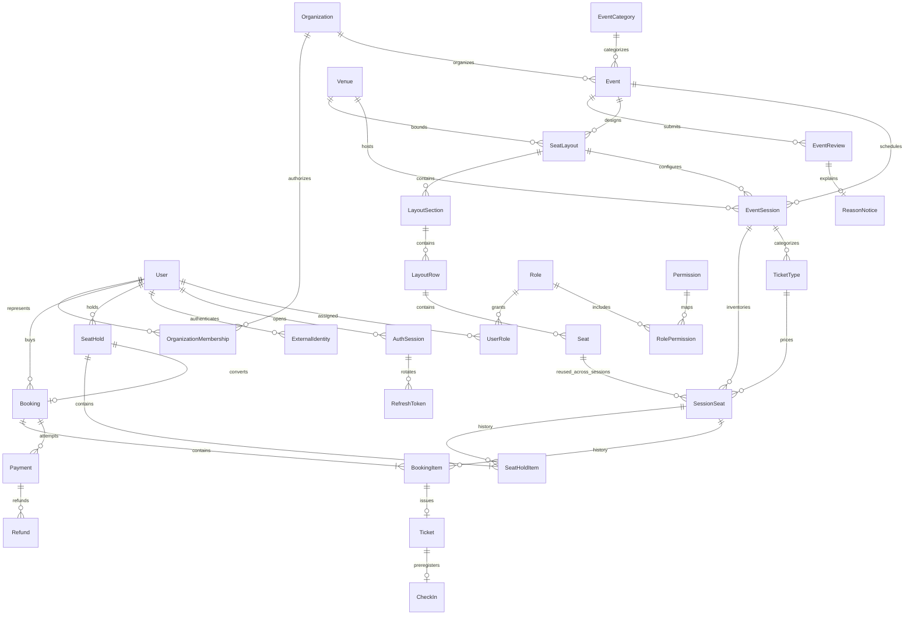

# 08. Thiết kế cơ sở dữ liệu

## Quy ước

Thiết kế logic đã cập nhật Organization/review/layout/Google-OTP/check-in theo [23](23-organization-review-seatmap.md). [database/schema.sql](../database/schema.sql) có 38 bảng và ERD đã đồng bộ theo ADR-014; DDL cho database rỗng, chi tiết vật lý tại [20](20-physical-sql-design.md). MySQL/InnoDB; phiên bản production cần chốt Q-016, phải hỗ trợ CHECK được thực thi; DDL đã kiểm tra trên MySQL 8.0.46. PK mặc định `id BIGINT UNSIGNED`; API biểu diễn ID thành chuỗi để tránh mất chính xác JavaScript. Các bảng dùng timestamp UTC; PaymentWebhook dùng received_at thay created_at. FK được index; FK lịch sử dùng RESTRICT, không cascade xóa giao dịch.

Tiền `BIGINT` đơn vị nhỏ nhất + currency `CHAR(3)`, API dùng chuỗi số; CHECK amount >= 0, xử lý BigInt/decimal chính xác. Không mặc định mọi currency có hai chữ số thập phân. Identity unique theo provider/subject; không unique email User hoặc tự merge theo email. Token hash kiểu binary với unique index. Trạng thái dùng chuỗi có CHECK/lookup được quản lý bằng migration. Các giá trị bắt buộc NOT NULL, optional được ghi rõ bên dưới; không dùng NULL để biểu diễn trạng thái chưa được thiết kế.

## Danh mục thực thể

PK của mọi hàng là `id` trừ bảng nối ghi rõ composite PK. “UQ” = unique; các FK đều có chỉ mục đơn hoặc nằm đầu chỉ mục ghép.

| Thực thể / mục đích | Cột chính và FK | Ràng buộc / unique | Index truy vấn ngoài PK/UQ/FK |
| --- | --- | --- | --- |
| User — tài khoản | display_name, status, auth_version; email/phone đã xác minh qua identity | Identity unique ở ExternalIdentity; không password_hash bắt buộc; status ACTIVE/BLOCKED | `(status,created_at,id)` quản trị |
| Role — nhóm quyền | code, name | UQ code | Không thêm |
| Permission — thao tác | code, description | UQ code | Không thêm |
| UserRole — vai trò được cấp | PK `(user_id,role_id)`; FK User, Role; granted_by FK User nullable khi bootstrap | Không trùng cặp | `(role_id,user_id)` tìm theo vai trò |
| RolePermission — ánh xạ quyền | PK `(role_id,permission_id)`; FK Role, Permission | Không trùng cặp | `(permission_id,role_id)` kiểm tra phụ thuộc |
| EventCategory — danh mục | name, slug, is_active | UQ slug | Không thêm |
| Event — nội dung | organization_id FK Organization, created_by FK User, category_id FK EventCategory, title, slug, description, status, version | UQ slug; trạng thái DRAFT/PENDING_REVIEW/REJECTED/PUBLISHED/BLOCKED/CANCELLED/ARCHIVED | `(status,category_id,id)`, `(organization_id,created_at,id)`, `(status,title,id)` tìm prefix |
| Venue — catalog địa điểm | name, address, city, timezone, bounds, max_capacity, status, version | Không owner_id Organizer; CHECK capacity > 0; geometry validate service | (city,id) |
| LayoutSection — khu trong layout | layout_id FK SeatLayout, code, name | UQ (layout_id,code) | FK layout |
| LayoutRow — hàng trong khu | section_id FK LayoutSection, code | UQ (section_id,code) | FK section |
| Seat — vị trí ghế trong layout | row_id FK LayoutRow, layout_id FK SeatLayout, number, map_x/map_y, width/height | UQ (row_id,number); composite scope layout; không coi là ghế vật lý dùng chung venue | FK layout/row |
| EventSession — suất diễn | event_id FK Event, venue_id FK Venue, layout_id FK SeatLayout, starts_at, ends_at, timezone, sale_opens_at, sale_closes_at, counter_opens_at/closes_at, admission_opens_at/closes_at, status, version | CHECK ends_at > starts_at, sale_closes_at > sale_opens_at; status SCHEDULED/CANCELLED/COMPLETED | `(event_id,status,starts_at)`, `(venue_id,starts_at,ends_at)` kiểm tra lịch |
| SessionSeat — tồn kho suất | session_id FK EventSession, seat_id FK Seat, layout_id scope, ticket_type_id FK TicketType, price_minor, currency, status, hold_id FK SeatHold nullable, current_booking_id FK Booking nullable, hold_expires_at nullable, version | UQ `(session_id,seat_id)`; CHECK tổ hợp trạng thái bên dưới | `(session_id,status,price_minor)`, `(status,hold_expires_at)`, `(hold_id,id)`, `(current_booking_id,id)` |
| SeatHold — nhóm giữ | customer_id FK User, session_id FK EventSession, status, expires_at | ACTIVE/CONVERTED/RELEASED/EXPIRED; expiry sau created_at | `(status,expires_at,id)`, `(customer_id,status,id)` |
| SeatHoldItem — giá đã báo | hold_id, session_seat_id, session_id qua composite FK, price_minor, currency | UQ `(hold_id,session_seat_id)`; price >= 0; cùng session ở hai FK | `(session_seat_id,session_id)` giữ lịch sử |
| Booking — đơn | customer_id FK User, session_id/event_id scope FK EventSession/Event, hold_id FK SeatHold, status, total_minor, currency, expires_at, confirmed_at nullable, confirmed_payment_id nullable | UQ hold_id; FK cùng chủ/suất hold; FK khoản xác nhận cùng booking; tổng tính tại service | `(customer_id,created_at,id)`, `(status,expires_at,id)`, `(session_id,status,id)` |
| BookingItem — dòng đơn | booking_id, session_seat_id, session_id qua composite FK, price_minor, currency, seat_label_snapshot, attendee_name_snapshot, ticket_type_code/name_snapshot | UQ `(booking_id,session_seat_id)`; cùng session ở hai FK | `(session_seat_id,session_id)` tra lịch sử |
| Ticket — quyền vào cửa | booking_item_id, session_seat_id qua composite FK, ticket_code_hash/ciphertext, ticket_key_version, status, admission_check_in_id FK CheckIn nullable, admitted_at/by nullable | UQ booking_item_id, ticket_code_hash; UQ active_seat_guard cho VALID/USED; USED cần CheckIn cùng vé và thời gian/người quét | `(status,id)` job expiry; `(admitted_by,admitted_at)` audit |
| Payment — attempt | booking_id FK Booking, provider, provider_reference nullable, provider_key, amount_minor, currency, status, reconciliation_status, reconciliation_reason nullable | UQ `(provider,provider_reference)` và `(provider,provider_key)`; active guard bên dưới | `(booking_id,created_at,id)`, `(status,updated_at,id)`, `(reconciliation_status,updated_at,id)` |
| Refund — khoản hoàn | payment_id FK Payment, requested_by FK User nullable cho System, approved_by FK User nullable, support_report_id FK SupportReport nullable, type, status, amount_minor, reason, provider, provider_key, provider_reference nullable | UQ `(provider,provider_key)`; UQ `(provider,provider_reference)`; số tiền > 0; full-refund guard bên dưới | `(payment_id,status,id)`, `(status,updated_at,id)` |
| AuthSession — phiên thiết bị | user_id FK User, identity_id FK ExternalIdentity, authenticated_at, family_id, expires_at, revoked_at nullable, device_label nullable | UQ family_id | `(user_id,revoked_at,id)`, `(expires_at,id)` |
| RefreshToken — token luân chuyển | session_id FK AuthSession, parent_id FK RefreshToken nullable, token_hash, expires_at, used_at nullable, revoked_at nullable | UQ token_hash; UQ parent_id để một token có tối đa một con | `(session_id,id)`, `(expires_at,id)` |
| OtpChallenge — login/verify OTP | channel, purpose, target_canonical, target_hash, code_mac, expires_at, attempts, used_at, user_id nullable | Phạm vi challenge/identity; code không lưu rõ; consume nguyên tử, HMAC key ngoài DB | (target_hash,purpose,created_at), expiry |
| IdempotencyRecord — chống lặp | actor_scope, operation, key, request_hash, resource_type, resource_id nullable, response_code nullable, expires_at | UQ `(actor_scope,operation,key)`; scope System tách riêng Customer | `(expires_at,id)` cleanup |
| PaymentWebhook — hộp nhận callback | provider, provider_event_id, payment_id FK Payment nullable, payload_hash, normalized_payload, status, attempts, last_error_code nullable, received_at, processed_at nullable | UQ `(provider,provider_event_id)`; dữ liệu chuẩn hóa đủ replay, không lưu bí mật/raw payload | `(status,received_at,id)` retry |
| OutboxMessage — công việc sau commit | type, aggregate_type/id/version, dedupe_key, payload_minimal, status, attempts, available_at, lease_until/token nullable, last_error_code nullable | UQ dedupe_key; PROCESSING cần expiry/token; ack có điều kiện token hiện hành | `(status,available_at,id)`, `(status,lease_until,id)` thu hồi lease |
| AuditLog — lịch sử nghiệp vụ | actor_type, actor_id FK User nullable, organization_id/support_report_id FK nullable, action, resource_type, resource_id, request_id, reason nullable, before_redacted nullable, after_redacted nullable | Append-only; resource đa hình không FK, không xóa cứng tài nguyên lịch sử | `(resource_type,resource_id,created_at)`, `(actor_id,created_at)`, `(request_id)` |

### Thực thể mới cho yêu cầu đã chốt

| Thực thể | Trường/quan hệ | Bất biến DB và service |
| --- | --- | --- |
| ExternalIdentity | user_id, provider GOOGLE/PHONE/COMPANY_EMAIL, subject/canonical_target, verified_at | UQ(provider,subject); không tự merge khi trùng email; một identity không thuộc hai User |
| Organization | name, company_domain, status, version, reviewed_by/at | Domain chuẩn hóa và xác minh email đại diện trước Admin duyệt; không password chung |
| OrganizationMembership | organization_id,user_id,company_identity_id,status,approved_by/at | UQ(org,user); identity thuộc đúng User; role chỉ có hiệu lực trong Organization APPROVED |
| ReservationQuota | customer_id,session_id | Composite PK; khóa FOR UPDATE trước Event; không cần cached counter, đếm phân bổ hiện hành dưới khóa |
| SeatLayout | organization_id,event_id,venue_id,venue_version,version,status DRAFT/FROZEN,geometry_json,bounds_snapshot,capacity_snapshot | UQ(id,event_id,venue_id) cho scope FK session; frozen bất biến; layout cùng Organization với Event |
| TicketType | session_id,code,name | UQ(session_id,code), scope FK SessionSeat; snapshot code/name vào item |
| EventReview | event_id,event_version,submitted_by/at,expires_at,earliest_session_starts_at,submission_cutoff_at,calendar_timezone,snapshot_json,status,decided_by/at | UQ(event_id,event_version); nullable pending guard UQ(event_id) cho PENDING; status transition/time ở service |
| ReasonNotice | review_id,reason_code,reason_text,guidance,status DRAFT/SENT,authored_by,sent_at | Một phiếu chính/review; SENT cần actor/text/time; phiếu đã gửi không sửa, message gửi thêm lưu riêng |
| Notification | recipient_user_id,type,review_id,reason_notice_id nullable,payload_redacted,read_at | UQ(recipient,type,review_id) cho notice chính; ghi cùng transaction/outbox; không phụ thuộc email |
| SupportReport | reporter_id,event_id,booking_id nullable,reason,status,assigned_admin_id | Scope rõ, booking nếu có phải thuộc event; UQ/FK phù hợp, không polymorphic scope không kiểm tra |
| CheckIn | ticket_id,method ONLINE/COUNTER,actor_id,checked_in_at | UQ ticket_id; không chuyển Ticket USED; actor khách đúng booking hoặc membership quầy đúng event |

Ticket mã nhập tay và QR dùng cùng secret ngẫu nhiên dưới hai cách biểu diễn để tránh hai nguồn quyền; hash lookup và ciphertext phục vụ chủ vé xem lại, không log. CheckIn tồn tại không thay kiểm tra VALID khi vào cửa. DDL dùng admitted_at/by và admission_check_in_id cho USED; CheckIn có checked_in_at riêng.

Các aggregate reference đa hình của audit/outbox/idempotency không có FK; service ghi trong transaction với tài nguyên tương ứng, job xử lý tài nguyên không tồn tại một cách tường minh. DDL thêm các FK vòng Booking–Payment, Ticket–CheckIn, Event–EventReview sau CREATE TABLE.

`IdempotencyRecord.request_hash` chứa hash request chuẩn hóa bao gồm route target và payload theo [09](09-api-design.md); không cần thêm cột target hoặc đổi unique scope hiện có. Metadata recovery phía trình duyệt không thay thế record DB và không có quyền tự xác nhận kết quả.

## Ràng buộc quan trọng

- AVAILABLE: hold_id, current_booking_id, hold_expires_at đều NULL.
- HELD: hold_id và hold_expires_at NOT NULL; current_booking_id NULL trước checkout, có giá trị sau checkout.
- SOLD: current_booking_id NOT NULL, hold_id và hold_expires_at NULL.
- Session-seat phải thuộc layout frozen của session, layout đúng venue/event/Organization; composite FK scope và service kiểm tra dưới khóa. Bản vật lý dùng composite FK để bắt buộc booking cùng chủ/suất hold và items cùng session; các cột scope lặp được DB ràng buộc. Giá, tổng tiền và trạng thái liên bảng vẫn cần service.
- Không đặt UQ riêng trên `BookingItem.session_seat_id`: đơn hết hạn phải giữ lịch sử nhưng ghế được mua lại. Phân bổ hiện tại do một hàng SessionSeat duy nhất quyết định; vé một lần/booking item được bảo vệ bằng UQ.
- Payment dùng generated nullable `pending_booking_guard` để bảo vệ tối đa một attempt chờ. Không dùng successful_booking_guard: mọi khoản thực nhận phải lưu được, kể cả khoản thừa. Booking chọn một confirmed_payment_id qua FK đúng booking; các SUCCESS không được chọn cần đối soát. Xem ADR-011.
- MVP refund toàn bộ dùng generated guard payment_id cho REQUESTED/PROCESSING/FAILED/SUCCESS, NULL cho REJECTED; UQ ngăn nhiều yêu cầu hoàn toàn bộ cùng khoản. FAILED retry cùng hàng. Hoàn một phần cần thay thiết kế này, kiểm tra tổng dưới khóa payment và ledger riêng.
- Quyền vé khi hoàn/hủy và SessionSeat phải đổi cùng transaction. UQ generated active_seat_guard trên Ticket chặn hai vé VALID/USED cùng session-seat; join vẫn cần để kiểm tra vé khớp phân bổ hiện tại và booking đã trả tiền.

## Quan hệ

Quan hệ Ticket ownership đi qua BookingItem → Booking → Customer (không lặp customer_id trên Ticket). EventSession và Seat là N:M qua SessionSeat. User–Role và Role–Permission là N:M. Một BookingItem có 0 hoặc 1 Ticket; sau xác nhận phải có đúng 1.

## Chuẩn hóa và chỉ mục

Mô hình hướng 3NF: venue/layout/section/row tách riêng, permission/role tách riêng. Ngoại lệ có chủ đích: giá và nhãn ghế snapshot trên item để lịch sử không đổi; booking total để đối soát (luôn kiểm tra tổng); SessionSeat lưu trạng thái phân bổ và expiry để khóa/scan nhanh; Refund lặp provider từ Payment để tạo unique theo namespace nhà cung cấp. Mọi dữ liệu lặp được ghi cùng transaction và kiểm tra khớp nguồn, không coi là nguồn độc lập.

Chỉ mục ghép đặt cột lọc bằng trước rồi khoảng thời gian/ID khi phù hợp. Không thêm index mọi cột: mỗi index làm ghi/khóa tốn hơn. Đo EXPLAIN với event nhiều suất/ghế và phân bố trạng thái thực. Dùng truy vấn phân trang tránh N+1; SQL thống kê không khóa bảng tồn kho lâu.

QR là opaque token ngẫu nhiên; hash để lookup, ciphertext mã hóa bằng key riêng để chủ vé xem lại QR. Tách key khỏi DB, không log ciphertext/token và phải có phương án xoay key. Phương án token ký không cần ciphertext được xem trong ADR-007, chưa dùng đồng thời hai thiết kế.
