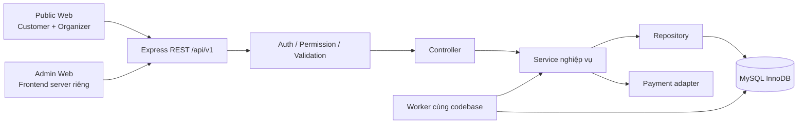

# 10. Kiến trúc backend

## Cấu trúc tổng thể

Modular Monolith, một ứng dụng backend triển khai chung, module theo nghiệp vụ. Public Web (Customer + Organizer) và Admin Web độc lập cùng gọi một REST API; Express điều phối; MySQL giữ dữ liệu có thẩm quyền. Worker có thể chạy cùng codebase bằng entrypoint riêng, chưa cần message broker. ADR-001/ADR-002/ADR-006/ADR-016 giải thích đánh đổi.



## Trách nhiệm và phụ thuộc

| Tầng | Được làm | Không được làm |
| ---------- | ------------------------------------------------------------------------- | ------------------------------------------------------ |
| Route | Method/path, middleware, controller | SQL/nghiệp vụ |
| Middleware | Request ID, auth/session, permission tổng quát, schema, rate limit | Thay thế kiểm tra ownership trong service |
| Controller | Chuyển request đã validate thành DTO/actor, gọi service, map response | Tính giá, chuyển trạng thái, BEGIN/COMMIT |
| Service | Policy/ownership, bất biến, tính giá, state machine, transaction boundary | Phụ thuộc trực tiếp req/res Express |
| Repository | Query có tham số, khóa theo chỉ thị, nhận transaction connection | Tự quyết định quyền, tự commit transaction của service |
| Database | FK/UQ/CHECK/ACID | Chứa toàn bộ chính sách ngầm trong trigger |
| Adapter | Chuẩn hóa hợp đồng provider, xác minh callback, timeout/retry vận chuyển | Tự xác nhận booking hoặc ghi thẳng vé |

Service chịu trách nhiệm transaction bằng một Unit of Work mỏng; mọi repository trong transaction dùng cùng connection. Không giả định các query từ pool tự nằm cùng transaction. Một operation gọi nhiều module qua application service/interface, không import controller hoặc repository nội bộ của module khác tùy tiện. Coordinator booking/payment được phép gọi các interface tham gia cùng transaction, có owner rõ ràng.

## Cấu trúc thư mục hiện hành

Khung đã tạo theo ADR-015; module nghiệp vụ mới có thư mục, chưa có controller/service giả. Chi tiết chạy ở [24](24-local-development.md).

```text
BE/
  src/
    app.ts
    server.ts
    config/
    modules/                  # auth, users, organizations, event-reviews,
                              # support-reports, layouts, events, venues,
                              # sessions, bookings, payments, tickets, audit,
                              # notifications
    shared/
      database/
      errors/
      middleware/
      logging/
      outbox/
    scripts/
  tests/                      # test nền tảng; integration/concurrency reserved
  migrations/                 # hướng dẫn; chưa có runner tự chạy
Fe/src/
  app/
  features/                   # Customer + Organizer; không chứa Admin
  shared/
AdminFe/                      # frontend Admin độc lập, sẽ scaffold khi triển khai
Docs/
database/
```

Workspace hiện có hai ứng dụng `BE/` và `Fe/` theo ADR-008/015; `AdminFe/` sẽ trở thành workspace/frontend thứ ba khi triển khai ADR-016. Cả hai frontend vẫn gọi một `BE/`; không tạo backend Admin riêng. Repo dùng mysql2 SQL trực tiếp, Zod và Vitest; chưa chọn migration runner. Không tạo package shared trừ khi có hợp đồng thật cần dùng chung; không chia sẻ DB entity chứa password hash sang frontend.

## Validation ba lớp

1. **Schema ở biên:** email có cấu trúc hợp lệ, mảng ghế không rỗng/không trùng, ID đúng kiểu, query range hợp lệ. Webhook, job payload, biến môi trường cũng phải validate.
2. **Nghiệp vụ tại service:** ghế còn trống, event đang bán, user sở hữu hold, refund được phép. Dữ liệu thay đổi đồng thời phải kiểm tra lại dưới khóa.
3. **Ràng buộc DB:** identity provider/subject unique, session-seat unique, FK hợp lệ, amount không âm. Đây là hàng rào cuối khi có lỗi ứng dụng/race; không thay thế lỗi dễ hiểu ở service.

Ví dụ email hợp lệ về cú pháp có thể trùng; precheck không ngăn được hai đăng ký đồng thời, cần UQ và xử lý lỗi. Tương tự, snapshot ghế trên UI không phải bằng chứng còn ghế lúc checkout.

## Tác vụ bất đồng bộ

Transaction ghi outbox cùng trạng thái cần hậu xử lý. Worker claim theo lease ngắn rồi commit; gọi mạng ngoài transaction; đánh dấu DONE sau thành công. Crash sau gửi trước DONE có thể gửi lặp: consumer dùng dedupe/provider key, không tuyên bố exactly-once qua mạng. Các job hết hạn/đối soát chạy được nhiều lần, không phụ thuộc timer trong RAM. Worker và API cùng tuân thủ [11](11-booking-concurrency.md).

Phát hành Ticket là ghi DB trong transaction xác nhận MVP; tạo hình QR, render PDF hoặc gửi email có thể làm sau. Nếu sau này chuyển phát vé sang worker, phải thêm trạng thái và cơ chế phục hồi bằng ADR, không âm thầm tạo khoảng trống PAID chưa có vé.

## Module phục vụ nghiệp vụ mới

Organization service xử lý application/membership/company identity; EventReview service submit/approve/reject/expiry và reason notice; Layout service validate bounds/capacity/scope/freeze; Ticket service tách CheckIn và admission; SupportReport service kiểm tra ngữ cảnh Admin can thiệp. Notification review và OTP/email adapter thuộc MVP, không còn chỉ là placeholder sau MVP.

Các module vẫn ở cùng monolith/transaction context. Google/OTP proof được xác minh ở auth adapter/service, không trong controller hoặc repository. Không gọi SMS/email trong transaction. Frontend editor chỉ tạo DTO, backend phải validate hình học và scope; repository dùng schema hiện hành theo 20 và tuân thủ các bất biến service chưa được DDL tự thực thi.
