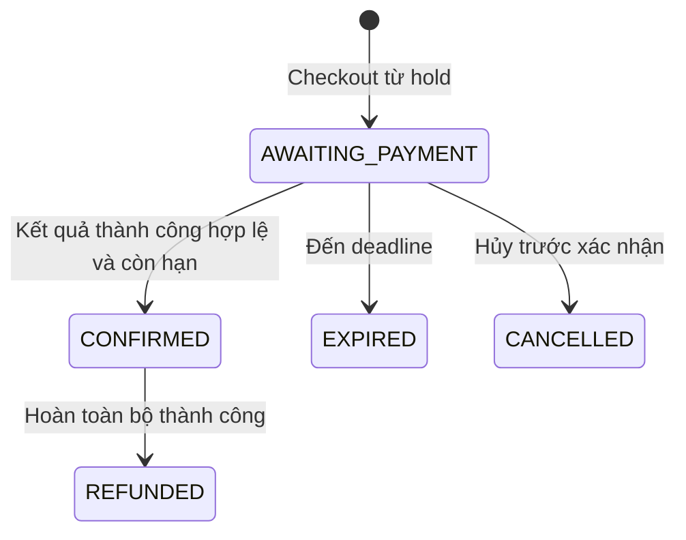

# 07. Quy tắc nghiệp vụ và máy trạng thái

Quy tắc có Q là đề xuất `DECISION REQUIRED`; bất biến kỹ thuật chống mất/trùng dữ liệu luôn bắt buộc.

## Danh mục quy tắc

| ID | Quy tắc |
| --- | --- |
| BR-001 | Trong một session, một seat chỉ có một chủ phân bổ hiện tại và tối đa một vé có quyền vào cửa tại một thời điểm |
| BR-002 | Ghế HELD còn hạn không thể giữ/bán cho khách khác; xử lý nhóm ghế nguyên tử |
| BR-003 | Hold hết hạn khi `expires_at <= DB_NOW`; TTL cấu hình theo Q-001, worker chậm không kéo dài quyền giữ |
| BR-004 | Chỉ phát vé khi payment thành công đã xác minh, booking hợp lệ và vẫn sở hữu tất cả ghế |
| BR-005 | Event CANCELLED/BLOCKED hoặc session không bán không nhận hold/booking/xác nhận mới; thành công payment muộn cần bù trừ |
| BR-006 | Một hold chỉ thuộc một khách/một session và chuyển thành tối đa một booking; Q-007 |
| BR-007 | Checkout không gia hạn hold; deadline booking bằng expiry đã báo; Q-001 |
| BR-008 | Số ghế/đơn, hold đang hoạt động và giới hạn tài khoản theo Q-002; không hardcode số chưa chốt |
| BR-009 | Giá hold được chụp lúc giữ; booking chụp từ hold item và tổng tính trên server; currency/thuế/phí theo Q-003 |
| BR-010 | Mỗi lần thử payment có key riêng; một booking chỉ có một attempt PENDING; timeout mạng chưa chứng minh thất bại |
| BR-011 | Callback xác minh nguồn, payment reference, amount, currency; lặp không tạo thêm hiệu ứng |
| BR-012 | Payment SUCCESS đến sau hạn/hủy hoặc mất phân bổ vẫn được ghi nhận tiền; không hồi sinh booking, phải đối soát/hoàn tiền |
| BR-013 | Mỗi booking item có tối đa một ticket; rollback phát vé cũng rollback xác nhận đơn/tồn kho |
| BR-014 | QR không chứa PII; không thể dùng chỉ bằng ID tuần tự; không log QR/token |
| BR-015 | Check-in chỉ cho VALID, đúng session/cửa sổ thời gian, người quét có quyền; hai lần quét chỉ một lần chuyển USED |
| BR-016 | Ticket USED/CANCELLED/REFUNDED/EXPIRED không thể check-in hoặc tự trở lại VALID |
| BR-017 | Refund không vượt số thực nhận trừ số đã hoàn và đang xử lý; mọi khoản cùng currency |
| BR-018 | Điều kiện refund, deadline, người duyệt, phí và bán lại ghế theo Q-004; đề xuất chỉ hoàn toàn bộ vé chưa dùng |
| BR-019 | Booking đã CONFIRMED không chuyển CANCELLED để bỏ qua hoàn tiền; event hủy không đồng nghĩa tiền đã hoàn |
| BR-020 | Organizer chỉ sửa event và xem doanh số thuộc mình; role cần được cấp hợp lệ theo Q-005 |
| BR-021 | Venue/sơ đồ có session đang giữ hoặc đã bán không được sửa cấu trúc phá ánh xạ; thay đổi cần phiên bản/chính sách Q-009/Q-010 |
| BR-022 | Session phải kết thúc sau bắt đầu, cửa sổ bán hợp lệ; xung đột venue và đổi lịch theo Q-010 |
| BR-023 | Chỉ xóa cứng event nháp/venue chưa có phụ thuộc; giao dịch lưu lịch sử và FK không cascade xóa tiền/vé |
| BR-024 | Tài khoản BLOCKED không tạo phiên, giữ ghế hoặc mua; khóa thu hồi phiên; đơn cũ vẫn được đối soát |
| BR-025 | Khách không tự cấp role, chỉnh giá/trạng thái booking/payment hoặc gán chủ sở hữu |
| BR-026 | Admin thao tác quyền/khóa/refund phải có quyền cụ thể, lý do và audit; không bypass BR-001/BR-004 |
| BR-027 | Doanh thu thành công và hoàn tiền được báo riêng; payment thất bại/đang chờ không là doanh thu |
| BR-028 | Timestamp lưu UTC và dựa giờ DB cho expiry; UI hiển thị timezone session |
| BR-029 | Email/token chuẩn hóa và lifecycle theo Q-006; reset không tự mở khóa tài khoản |
| BR-030 | Email, realtime, AI lỗi không thay đổi kết quả giao dịch đã commit |
| BR-031 | Client không có quyền báo thanh toán thành công; mock chỉ chạy ngoài production |
| BR-032 | Idempotency key có scope actor/operation, hash payload; cùng key khác payload trả 409 |

## Vòng đời event và session

Đề xuất event DRAFT → PUBLISHED khi đạt điều kiện publish; DRAFT/PUBLISHED → CANCELLED khi hủy hợp lệ; PUBLISHED → BLOCKED bởi Admin. PUBLISHED → ARCHIVED chỉ khi mọi session đã kết thúc và không còn công việc bán đang chờ. BLOCKED không tự trở về PUBLISHED; quy trình mở lại/duyệt lại thuộc Q-010 và chưa có endpoint MVP. CANCELLED/ARCHIVED không nhận giao dịch mới. Sự kiện hủy/block có thể còn nghĩa vụ xử lý tiền/vé, không xóa tài nguyên.

Session bắt đầu SCHEDULED, chuyển CANCELLED khi hủy hoặc COMPLETED sau giờ kết thúc. Điều kiện “đang bán” là event PUBLISHED, session SCHEDULED và `sale_opens_at <= DB_NOW < sale_closes_at`, cùng chính sách so với giờ diễn theo Q-010. Chưa tự quyết định bán sau giờ bắt đầu có được phép. Danh sách công khai không đồng nghĩa suất đang mở bán; UI phải hiển thị đúng cửa sổ bán.

## Booking state machine

Không dùng PENDING/HOLDING vì SeatHold quản lý giữ ghế trước checkout. Không có PAID trung gian vì MVP xác nhận và phát vé cùng transaction DB. “Đã trả tiền nhưng không được cấp vé” là trạng thái của Payment kèm đối soát, không tạo trạng thái booking mơ hồ.

| Chuyển | Điều kiện và hiệu ứng |
| --- | --- |
| Tạo → AWAITING_PAYMENT | Hold đúng chủ, còn hạn; lưu giá và expiry |
| AWAITING_PAYMENT → CONFIRMED | Payment hợp lệ, event/session cho bán, chưa hết hạn; chuyển ghế SOLD, tạo Ticket VALID |
| AWAITING_PAYMENT → EXPIRED | Giờ DB đạt deadline; giải phóng toàn nhóm ghế còn thuộc đơn |
| AWAITING_PAYMENT → CANCELLED | Khách hủy được phép hoặc event bị dừng; nhả ghế; payment đang chờ vẫn cần theo dõi |
| CONFIRMED → REFUNDED | Refund toàn bộ thành công; vé REFUNDED; ghế xử lý theo Q-004 |

EXPIRED/CANCELLED/REFUNDED là kết thúc trong MVP. Cấm EXPIRED → CONFIRMED, CANCELLED → AWAITING_PAYMENT, CONFIRMED → CANCELLED. Payment thất bại không kết thúc booking nếu còn hạn; refund đang chờ nằm ở Refund, booking vẫn CONFIRMED và vé bị vô hiệu hóa khi refund được duyệt.

## Payment state machine

Một hàng là một attempt. Bỏ CREATED vì PENDING được ghi trước lần gọi adapter đầu tiên; chưa rõ đã gửi vẫn PENDING và phải retry bằng cùng provider key. Không dùng EXPIRED cho timeout mạng; timeout checkout thuộc Booking.

| Chuyển | Điều kiện |
| --- | --- |
| Tạo → PENDING | Lưu booking, số tiền, currency, provider key trước gọi ngoài |
| PENDING → SUCCESS | Kết quả thành công đã xác minh; có thể đi vào đối soát nếu booking hết hạn |
| PENDING → FAILED | Nhà cung cấp xác nhận thất bại cuối cùng; không chỉ do HTTP timeout |
| SUCCESS → REFUNDED | Tổng refund thành công bằng số tiền payment |
| SUCCESS → PARTIALLY_REFUNDED | Sau MVP, Q-004; chưa triển khai trạng thái này ở MVP |
| PARTIALLY_REFUNDED → REFUNDED | Sau MVP, hoàn hết số còn lại |

Không FAILED → PENDING; retry tạo attempt mới. Nếu nhà cung cấp gửi SUCCESS cho attempt từng xác nhận FAILED, cách ly và đối soát theo hợp đồng provider; không tự phát vé, không bỏ qua khoản tiền. Callback thành công trùng hoặc thất bại đến sau SUCCESS không đảo trạng thái. `reconciliation_status = NONE/REQUIRED/RESOLVED` và lý do lưu riêng với trạng thái tiền.

Refund: REQUESTED → REJECTED hoặc PROCESSING (duyệt và thu hồi quyền vé); PROCESSING → SUCCESS hoặc FAILED khi có kết quả chắc chắn; FAILED → PROCESSING khi người có quyền retry cùng refund/provider key. Kết quả chưa rõ giữ PROCESSING. Không tạo refund mới chỉ vì timeout. Hoàn tiền bù trừ do BR-012 có loại COMPENSATION, tự động hóa chỉ sau Q-004; trước đó tạo công việc đối soát.

## Ticket state machine

| Chuyển | Điều kiện |
| --- | --- |
| Tạo → VALID | Booking CONFIRMED trong cùng transaction |
| VALID → USED | Check-in nguyên tử, ghi người quét và thời gian |
| VALID → CANCELLED | Refund đã duyệt hoặc event hủy/block cần thu hồi theo Q-010 |
| VALID → EXPIRED | Hết cửa sổ vào cửa theo Q-008 |
| CANCELLED → REFUNDED | Hoàn tiền liên quan thành công |

Vé USED không bị job expiry đổi trạng thái, để giữ lịch sử. Hoàn vé USED/EXPIRED là `DECISION REQUIRED (Q-004)` ngoài đề xuất MVP. Ticket EXPIRED khác booking EXPIRED: vé có thể đã được trả tiền nhưng không dùng đúng thời gian. Không phát hành lại vé bị hủy khi refund lỗi; cần quy trình có duyệt riêng.

SeatHold: ACTIVE → CONVERTED/RELEASED/EXPIRED. CONVERTED không dùng lại; booking nhận trách nhiệm expiry. SessionSeat: AVAILABLE → HELD → SOLD; HELD → AVAILABLE khi nhả/hết hạn. SOLD → AVAILABLE chỉ khi có chính sách bán lại Q-004 và transaction thu hồi toàn bộ quyền vé cũ.
